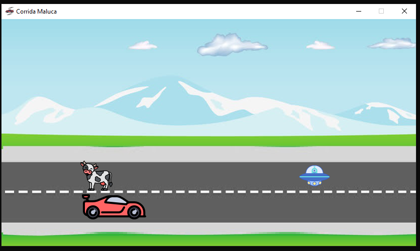

<strong>Versão 1.0.1</strong>

* * *

# [+] Instalação

- Clone o repositório: `git clone https://github.com/Fr4ncisTaylor/CorridaMaluca`
- Entre no diretório: `cd CorridaMaluca`
- Instale o PyGame: `pip install -r requiriments.txt`
- Inicie o programa: `python main.py`

* * *

